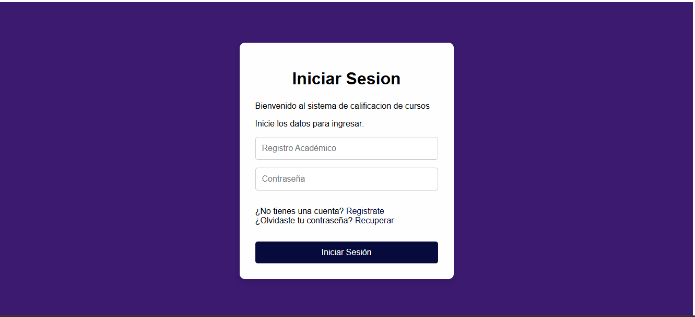
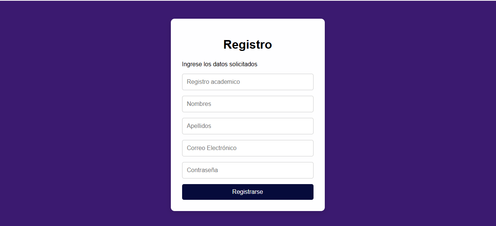
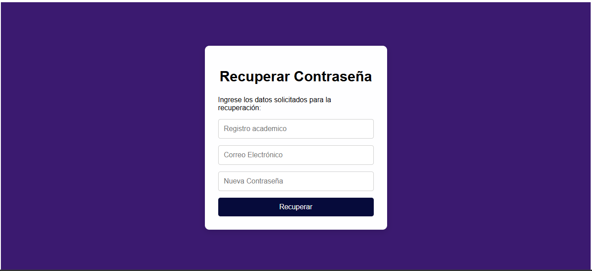
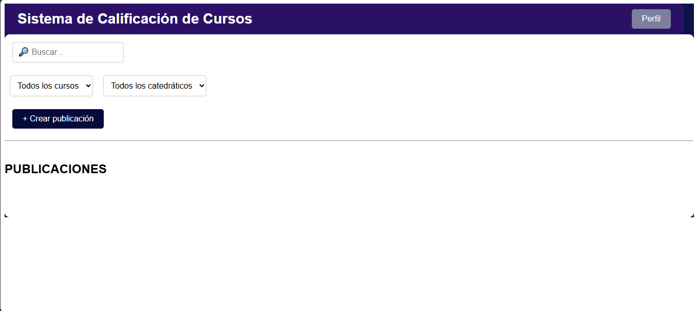

# Manual de Usuario

## Sistema de Calificación de Cursos

---

## 1. Introducción

El Sistema de Calificación de Cursos es una aplicación web que permite a los usuarios acceder a un espacio destinado a la consulta y publicación de información relacionada con cursos y catedráticos.

El sistema cuenta con diferentes funcionalidades para la gestión del acceso de los usuarios y la interacción con las publicaciones disponibles dentro de la plataforma.

Este manual tiene como objetivo explicar de manera sencilla cómo utilizar las principales funciones disponibles en el sistema.

---

## 2. Acceso al sistema

Para utilizar el sistema, el usuario debe ingresar a la aplicación desde un navegador web.

Al acceder al sistema se mostrará la pantalla de inicio de sesión, desde donde el usuario podrá ingresar sus credenciales o acceder a las opciones de registro y recuperación de contraseña.

---

# 3. Inicio de sesión

La pantalla de inicio de sesión permite al usuario ingresar al sistema utilizando sus datos de acceso.

### 3.1 Datos solicitados

El formulario de inicio de sesión contiene los siguientes campos:

- Registro Académico

- Contraseña

También se encuentran disponibles las opciones:

- Iniciar sesión

- Registrarse

- Recuperar contraseña

### 3.2 Procedimiento para iniciar sesión

1. Ingrese su **Registro Académico**.

2. Ingrese su **Contraseña**.

3. Presione el botón **Iniciar Sesión**.

4. Si los datos son correctos, el sistema permitirá acceder a la página principal.

### Captura de pantalla

**Figura 1. Pantalla de inicio de sesión.**

---

# 4. Registro de usuario

Los usuarios que aún no poseen una cuenta pueden registrarse desde la pantalla de inicio de sesión.

Para acceder al formulario de registro, se debe seleccionar la opción **Registrarse**.

### 4.1 Datos de registro

El formulario solicita información básica del usuario:

- Registro Académico

- Nombres

- Apellidos

- Correo Electrónico

- Contraseña

### 4.2 Procedimiento para registrarse

1. Seleccione la opción **Registrarse** desde la pantalla de inicio de sesión.

2. Ingrese el **Registro Académico**.

3. Escriba sus **Nombres**.

4. Escriba sus **Apellidos**.

5. Ingrese su **Correo Electrónico**.

6. Establezca una **Contraseña**.

7. Complete el proceso de registro.

Una vez realizado el registro, el usuario podrá utilizar sus credenciales para acceder al sistema.

### Captura de pantalla

**Figura 2. Pantalla de registro de usuario.**

---

# 5. Recuperación de contraseña

La opción **Recuperar contraseña** permite al usuario iniciar el proceso para recuperar el acceso a su cuenta en caso de no recordar su contraseña.

Para acceder a esta función, el usuario debe seleccionar la opción correspondiente desde la pantalla de inicio de sesión.

### 5.1 Procedimiento

1. Seleccione **Recuperar contraseña**.

2. Ingrese la información solicitada por el sistema.

3. Siga las instrucciones mostradas en pantalla.

4. Complete el proceso de recuperación.

### Captura de pantalla

**Figura 3. Pantalla de recuperación de contraseña.**

---

# 6. Página principal

Después de iniciar sesión correctamente, el usuario accederá a la página principal del sistema.

La página principal permite consultar y gestionar el contenido disponible dentro de la plataforma.

Entre los elementos principales de esta pantalla se encuentran:

- Barra de navegación.

- Nombre del sistema.

- Botón de acceso al perfil.

- Barra de búsqueda.

- Filtro por curso.

- Filtro por catedrático.

- Botón para crear una publicación.

- Lista de publicaciones disponibles.

### 6.1 Búsqueda de publicaciones

El usuario puede utilizar el campo de búsqueda para localizar publicaciones dentro del sistema.

Para realizar una búsqueda:

1. Ubique el campo de búsqueda.

2. Escriba el término que desea buscar.

3. Revise las publicaciones mostradas como resultado.

### 6.2 Filtrar por curso

El sistema permite utilizar el filtro de **Curso** para facilitar la búsqueda de publicaciones relacionadas con un curso específico.

1. Seleccione el filtro de curso.

2. Seleccione el curso que desea consultar.

3. El sistema mostrará las publicaciones correspondientes.

### 6.3 Filtrar por catedrático

También es posible filtrar las publicaciones utilizando el nombre del catedrático.

1. Seleccione el filtro de **Catedrático**.

2. Seleccione o ingrese el catedrático que desea consultar.

3. Revise las publicaciones correspondientes.

### 6.4 Crear una publicación

El botón **+ Crear publicación** permite acceder al formulario correspondiente para crear una nueva publicación.

Para utilizar esta opción:

1. Seleccione **+ Crear publicación**.

2. Complete la información solicitada.

3. Ingrese el contenido de la publicación.

4. Confirme la creación de la publicación.

### 6.5 Consultar comentarios

Las publicaciones pueden contar con comentarios realizados por los usuarios.

Para consultar los comentarios:

1. Seleccione la publicación que desea revisar.

2. Acceda a la sección de comentarios.

3. Revise los comentarios asociados a la publicación.

### Captura de pantalla

**Figura 4. Página principal del Sistema de Calificación de Cursos.**

---

# 7. Navegación del sistema

La navegación del sistema permite desplazarse entre las diferentes secciones disponibles.

Las principales opciones de navegación descritas en este manual son:

| Sección              | Función                                              |
| -------------------- | ---------------------------------------------------- |
| Iniciar sesión       | Permite acceder al sistema                           |
| Registrarse          | Permite crear una nueva cuenta                       |
| Recuperar contraseña | Permite iniciar el proceso de recuperación de acceso |
| Home                 | Permite consultar y gestionar las publicaciones      |
| Crear publicación    | Permite crear una nueva publicación                  |
| Comentarios          | Permite consultar los comentarios de una publicación |

---

# 8. Recomendaciones de uso

Para utilizar correctamente el sistema se recomienda:

- Verificar que los datos ingresados sean correctos.

- Utilizar el Registro Académico correspondiente al usuario.

- Mantener segura la contraseña.

- Utilizar una dirección de correo electrónico válida.

- Revisar los datos antes de crear una publicación.

- Utilizar los filtros disponibles para facilitar la búsqueda de información.

---

# 9. Solución de problemas básicos

### No puedo iniciar sesión

Verifique que:

- El Registro Académico sea correcto.

- La contraseña haya sido escrita correctamente.

- No existan espacios adicionales en los campos.

Si el problema persiste, utilice la opción **Recuperar contraseña**.

### No encuentro una publicación

Utilice la barra de búsqueda o los filtros de **Curso** y **Catedrático** para reducir los resultados mostrados.

### No puedo encontrar un curso

Verifique que el nombre o selección del curso sea correcto y revise nuevamente los filtros disponibles.

---

# 10. Resumen de funciones

El sistema permite al usuario:

- Iniciar sesión.

- Crear una cuenta.

- Recuperar el acceso mediante la opción de recuperación de contraseña.

- Consultar publicaciones.

- Buscar publicaciones.

- Filtrar publicaciones por curso.

- Filtrar publicaciones por catedrático.

- Crear publicaciones.

- Consultar comentarios.

---
