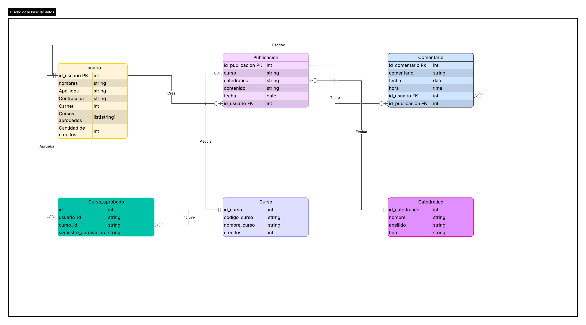

# Documentación Técnica del Proyecto

## 1. Requerimientos Técnicos

### 1.1. Backend (Node.js / Express)

- **express**: Framework web y enrutamiento de la API REST.
- **mysql2**: Driver de conexión a MySQL.
- **jsonwebtoken**: Generación y verificación de tokens JWT.
- **bcryptjs**: Cifrado de contraseñas de usuario.
- **cors**: Habilitación de peticiones de origen cruzado desde el frontend.
- **dotenv**: Gestión de variables de entorno.

### 1.2. Frontend (React)

- **react / react-dom**: Librería base de la interfaz de usuario.
- **react-router-dom**: Enrutamiento entre vistas de la aplicación.
- **axios**: Cliente HTTP para consumo de servicios API.
- **Context API**: Gestión de estado de sesión y autenticación.
- **Vite**: Herramienta de construcción y empaquetado del proyecto.
- **Tailwind CSS**: Framework de estilos e interfaz de usuario.

### 1.3. Base de Datos

- **Motor**: MySQL 8.0
- **Tablas principales**: `usuarios`, `catedraticos`, `cursos`, `publicaciones`, `comentarios`, `cursos_aprobados`.

### 1.4. Herramientas de Desarrollo

- **Git / GitHub**: Control de versiones y repositorio.
- **npm**: Gestor de paquetes de Node.js.
- **Postman**: Pruebas y validación de endpoints de la API.

## 2. Estructura de la Base de Datos

### Diagrama ER

## 3. Arquitectura del Backend

- **controllers/**: Lógica de negocio y controladores específicos para endpoints.
  - `aprobar.controller.js`: Gestión de aprobación y asignación de cursos.
  - `comentarios.controller.js`: Gestión e interacción de comentarios.
  - `login_register.controller.js`: Autenticación, registro y recuperación de contraseñas.
  - `perfil_cursos.controller.js`: Consulta y actualización de perfiles y cursos.
  - `publicaciones.controller.js`: Gestión de publicaciones y feedback.
- **routes/**: Definición y gestión de rutas HTTP.
- **index.js**: Punto de entrada y servidor principal de Express.
- **db.js**: Configuración y conexión con MySQL.
- **config.js**: Parámetros y constantes globales del sistema.

## 4. Especificación de Endpoints de la API

### 4.1. Autenticación y Cuentas

| Método | Endpoint | Descripción |
|---|---|---|
| POST | `/api/auth/login` | Inicia sesión validando carnet y contraseña. Retorna token en cookie HTTP-Only. |
| POST | `/api/auth/register` | Registra un nuevo usuario en el sistema cifrando la contraseña con bcrypt. |
| POST | `/api/auth/recuperar_contrasena` | Restablece la contraseña verificando carnet y correo electrónico. |

### 4.2. Perfiles y Usuarios

| Método | Endpoint | Descripción |
|---|---|---|
| GET | `/perfil` | Obtiene la información del perfil propio, cursos aprobados y total de créditos. |
| PUT | `/perfil` | Modifica nombres, apellidos u opcionalmente la contraseña del usuario autenticado. |
| GET | `/perfil/:carnet` | Consulta pública de información y cursos aprobados de otro usuario. |

### 4.3. Cursos

| Método | Endpoint | Descripción |
|---|---|---|
| GET | `/cursos` | Devuelve el catálogo completo de cursos del pensum con sus catedráticos asignados. |
| GET | `/cursos_aprobados` | Lista los cursos aprobados del usuario logueado y la suma de créditos acumulados. |
| POST | `/aprobar_curso` | Agrega un curso al expediente del estudiante e incrementa sus créditos. |
| DELETE | `/eliminar_curso_aprobado` | Remueve un curso del expediente del estudiante y descuenta los créditos correspondientes. |

### 4.4. Publicaciones y Comentarios

| Método | Endpoint | Descripción |
|---|---|---|
| GET | `/publicaciones` | Obtiene publicaciones cronológicas con soporte para filtros por curso, catedrático o texto. |
| POST | `/publicaciones` | Crea una nueva publicación sobre un curso, un catedrático o ambos. |
| GET | `/publicaciones/:id/comentarios` | Lista todos los comentarios de una publicación específica. |
| POST | `/publicaciones/:id/comentarios` | Agrega un nuevo comentario a la publicación especificada. |

## 5. Arquitectura del Frontend

- **main.jsx**: Inicializa el renderizado de la aplicación React y la enlaza con el DOM principal (`index.html`).
- **App.jsx**: Define las rutas del sistema utilizando `BrowserRouter` y asocia cada URL a su respectivo componente de página.
- **api.js**: Centraliza todas las peticiones HTTP al backend (`http://localhost:3000`), gestionando cabeceras JSON, cookies y control de errores.
- **pages/login/**: Formulario de inicio de sesión validando carnet y contraseña.
- **pages/registro/**: Formulario de alta de nuevos usuarios (nombres, apellidos, carnet, correo, contraseña).
- **pages/forget/**: Módulo de recuperación de contraseña verificando carnet y correo institucional.
- **pages/home/**: Muro de publicaciones ordenado cronológicamente con barra de búsqueda de texto y filtros dinámicos por curso y catedrático.
- **pages/crearPost/**: Formulario interactivo para registrar publicaciones dirigidas a un curso o a un catedrático.
- **pages/comentarios/**: Vista detallada de una publicación individual con su lista de comentarios y formulario para comentar.
- **pages/profile/**: Visualización de datos del estudiante, listado de cursos aprobados y total de créditos acumulados.
- **pages/edit-profile/**: Permite al usuario actualizar sus nombres, apellidos y contraseña.

### 5.1. Vistas y Funcionalidades Principales

#### 5.1.1. Autenticación y Cuentas

- **Login (`/`)**: Autenticación mediante carnet y contraseña. El servidor responde con una cookie HTTP-Only segura.
- **Registro (`/registro`)**: Alta de nuevos usuarios capturando datos personales, académicos y clave.
- **Recuperación de Contraseña (`/forget`)**: Validación de identidad por carnet y correo para reestablecer credenciales.

#### 5.1.2. Muro de Publicaciones (`/home`)

- **Orden cronológico**: Muestra el flujo de publicaciones más recientes primero.
- **Filtros dinámicos**: Búsqueda por texto libre, selección por curso o por catedrático.
- **Renderizado limpio**: Visualización condicional según la entidad evaluada (curso, catedrático o ambos).
- **Contador de interacción**: Muestra el número total de comentarios y acceso directo al detalle del post.

#### 5.1.3. Creación de Publicaciones (`/crearPost`)

- **Selección de entidad**: Permite elegir la categoría del post (Curso o Catedrático).
- **Validación previa**: Carga dinámicamente las opciones y valida el texto antes de publicarlo.

#### 5.1.4. Perfil y Expediente Académico (`/profile` y `/edit-profile`)

- **Información personal**: Datos del estudiante autenticado (carnet, nombres, apellidos, correo).
- **Expediente de cursos**: Listado de cursos aprobados con desglose de créditos e historial acumulado.
- **Edición de cuenta**: Actualización de datos personales y actualización de contraseña.

### 5.2. Integración con el Backend

- **Cliente HTTP centralizado**: Administrado desde `src/api.js`.
- **Base URL**: `http://localhost:3000` (configurable vía `VITE_API_URL`).
- **Gestión de sesiones**: Envío de credenciales activado (`credentials: 'include'`) para la transferencia automática de cookies de autenticación.
